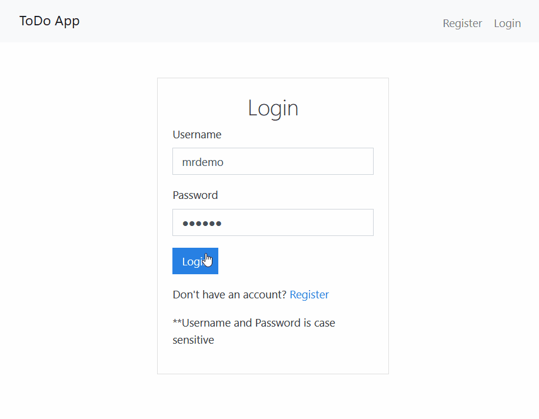

# todoapp

### Technologies Used:
* Django
*	ReactJs
* Redux
*	HTML
*	CSS

### Libraries Used:
*	djangorestframework

#### Demo account:
**Username**: sam \
**Password**: 123456

App link: https://todoapphero.herokuapp.com/
